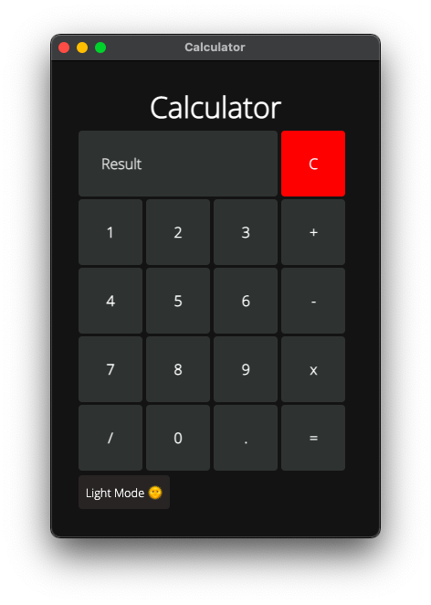

# calculator-electron

A Cross platform calculator application made using javascript and electron



## Setup

```sh
$ git clone https://github.com/zaidajani/calculator-electron.git

$ cd calculator-electron

$ npm i

// To install all the dependencies

$ npm start 

// Your application will run to life.
```

## Enjoy your application
